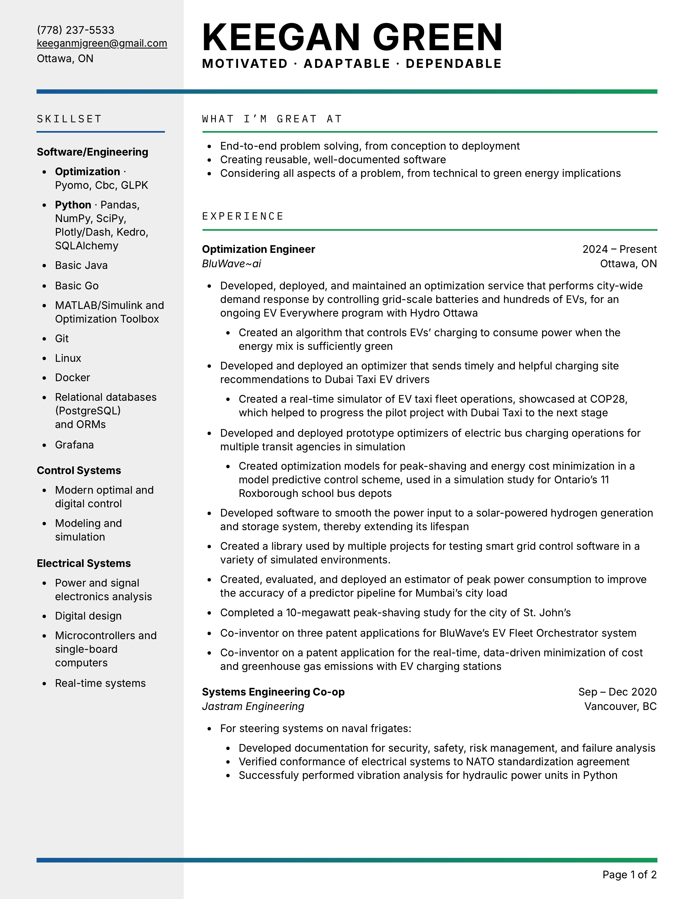
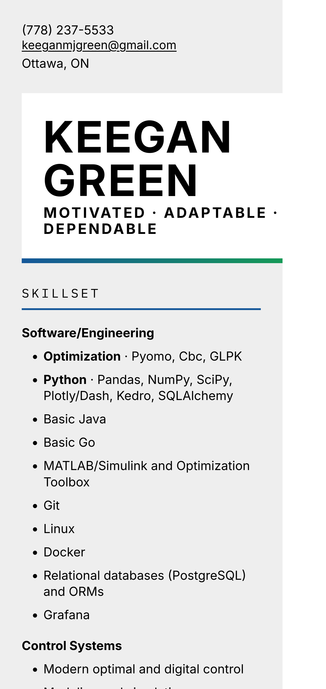
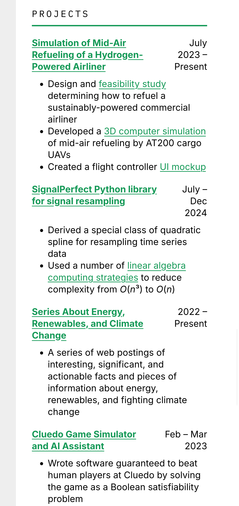
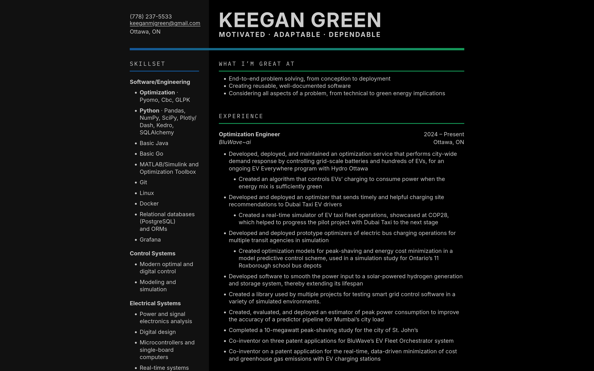
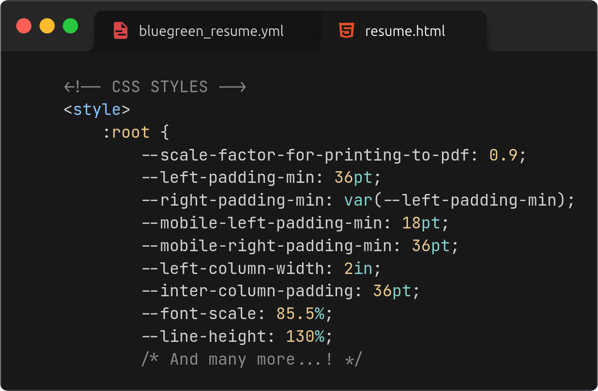
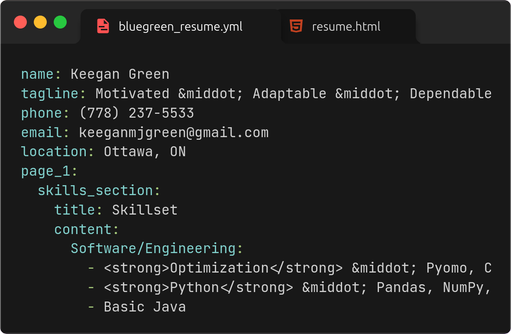

# Bluegreen resume template

Get your next **cleantech** role.

|                                                                                                                 |                                                                                                       |
|-----------------------------------------------------------------------------------------------------------------|-------------------------------------------------------------------------------------------------------|
| **One command** generates portable HTML and PDF files, for ease of sharing with others or hosting as a website. |                                                                 |
| **Responsive layout** that looks great both on the web and on mobile.                                           |   |
| **Automatic dark mode** to match that of whatever device the HTML page is being viewed on.                      |                                                                |
| **Extremely customizable** (fonts, colors, spacing, etc.) thanks to CSS variables.                              |                                                 |
| **Easy to fill in** your resume details, thanks to one YAML config file.                                        |                                                           |

## Getting started

1. Fill in the `resume.yml` template with your resume details.
2. Customize the CSS variables in `bluegreen_resume_template.html` to your liking.
3. Run `build_resume.sh` to generate a portable HTML resume (`resume.html`) and a two-page resume PDF (`resume.pdf`) of equal quality. This requires:
   - [uv](https://docs.astral.sh/uv/)
   - Google Chrome (to print the resume to PDF in the background)
