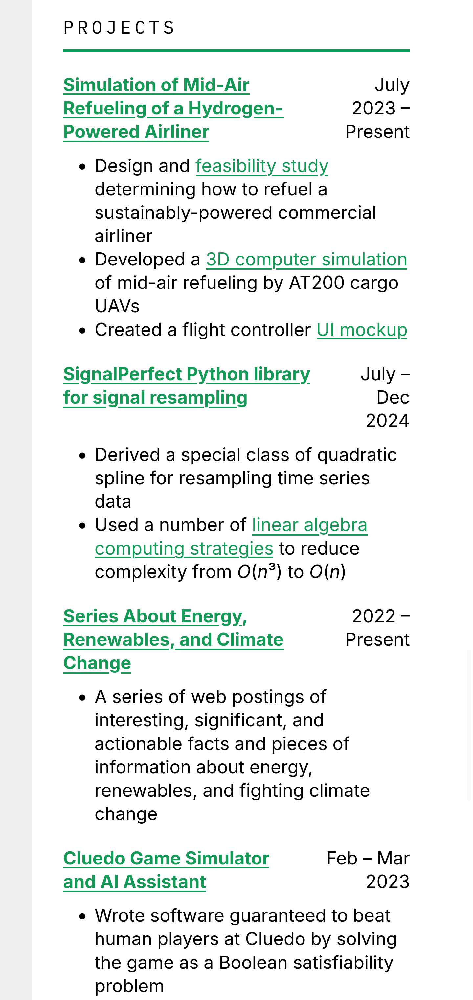
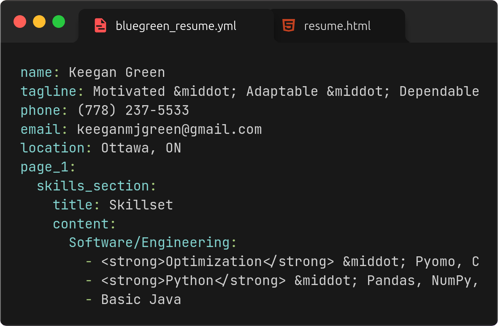

# Bluegreen resume template

Get your next <text style="font-weight: bold; background: linear-gradient(to right, #159957, #155799); -webkit-background-clip: text; background-clip: text; color: transparent; ">cleantech</text> role.

    
<text style="font-size: large; font-weight: bold; background: linear-gradient(to right, #155799, #159957); -webkit-background-clip: text; background-clip: text; color: transparent; ">One command</text> generates portable HTML and PDF files, for ease of sharing with others or hosting as a website.

    

 <!-- pdftoppm -png -r 300 resume.pdf resume.png -->
    
 

    
<text style="font-size: large; font-weight: bold; background: linear-gradient(to right, #155799, #159957); -webkit-background-clip: text; background-clip: text; color: transparent; ">Responsive layout</text> that looks great both on the web and on mobile.

    
<text style="font-size: large; font-weight: bold; background: linear-gradient(to right, #155799, #159957); -webkit-background-clip: text; background-clip: text; color: transparent; ">Automatic dark mode</text> to match that of whatever device the HTML page is being viewed on.

    

    

    
<text style="font-size: large; font-weight: bold; background: linear-gradient(to right, #155799, #159957); -webkit-background-clip: text; background-clip: text; color: transparent; ">Extremely customizable</text> (fonts, colors, spacing, etc.) thanks to CSS variables.

    
<text style="font-size: large; font-weight: bold; background: linear-gradient(to right, #155799, #159957); -webkit-background-clip: text; background-clip: text; color: transparent; ">Easy to fill in</text> your resume details, thanks to one YAML config file.

    

## Getting started

1. Fill in the `bluegreen_resume.yml` template with your resume details.
2. Customize the CSS variables in `bluegreen_resume_template.html` to your liking.
3. Run `build_resume.sh` to generate a portable HTML resume (`resume.html`) and a two-page resume PDF (`resume.pdf`) of equal quality. This requires:
   - python>=3.10
   - pydantic>=2
   - pyyaml
   - Google Chrome (to print the resume to PDF in the background)
